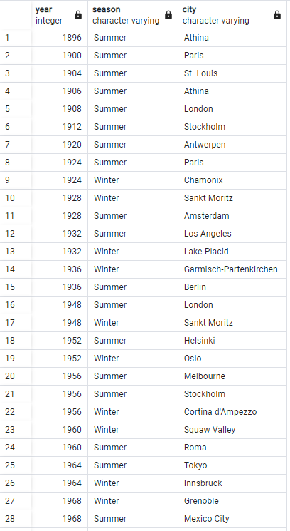
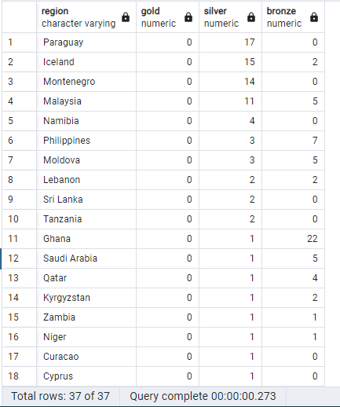
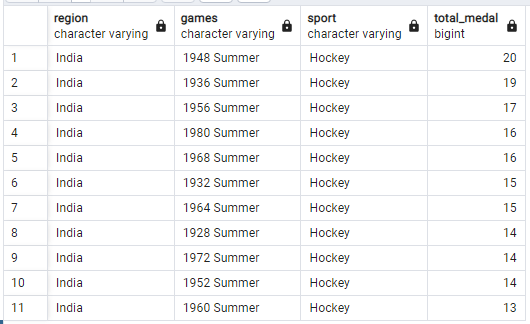

# Olympic-Analysis-Project-03
In this part I did analytics using SQL. This project following youtube video from the TechTFQ. Here is the URL : [Practice Writing SQL Queries](https://www.youtube.com/watch?v=XruOBp7yPXU&t=802s).

The data used is [120 years of Olympic history](https://www.kaggle.com/datasets/heesoo37/120-years-of-olympic-history-athletes-and-results) from Kaggle. The tools used to process the dataset is **PostgresSQL**.

### Problem Statement
Write SQL query to provide answer of the following questions:
1. [How many olympics games have been held?](#q01-how-many-olympics-games-have-been-held)
2. [List down all Olympics games held so far](#q02-list-down-all-olympics-games-held-so-far)
3. [Mention the total no of nations who participated in each olympics game?](#q03-mention-the-total-no-of-nations-who-participated-in-each-olympics-game)
4. [Which year saw the highest and lowest no of countries participating in olympics?](#q04-which-year-saw-the-highest-and-lowest-no-of-countries-participating-in-olympics)
5. [Which nation has participated in all of the olympic games?](#q05-which-nation-has-participated-in-all-of-the-olympic-games)
6. [Identify the sport which was played in all summer olympics.](#q06-identify-the-sport-which-was-played-in-all-summer-olympics)
7. [Which Sports were just played only once in the olympics?](#q07-which-sports-were-just-played-only-once-in-the-olympics)
8. [Fetch the total no of sports played in each olympic games](#q08-fetch-the-total-no-of-sports-played-in-each-olympic-games)
9. [Fetch details of the oldest athletes to win a gold medal](#q09-fetch-details-of-the-oldest-athletes-to-win-a-gold-medal)
10. [Find the Ratio of male and female athletes participated in all olympic games](#q10-find-the-Ratio-of-male-and-female-athletes-participated-in-all-olympic-games)
11. [Fetch the top 5 athletes who have won the most gold medals](#q11-fetch-the-top-5-athletes-who-have-won-the-most-gold-medals)
12. [Fetch the top 5 athletes who have won the most medals (gold/silver/bronze)](#q12-fetch-the-top-5-athletes-who-have-won-the-most-medals-(gold/silver/bronze))
13. [Fetch the top 5 most successful countries in olympics. Success is defined by no of medals won](#q13-fetch-the-top-5-most-successful-countries-in-olympics-success-is-defined-by-no-of-medals-won)
14. [List down total gold, silver and broze medals won by each country](#q14-list-down-total-gold-silver-and-broze-medals-won-by-each-country)
15. [List down total gold, silver and broze medals won by each country corresponding to each olympic games](#login-optional-fields)
16. [Identify which country won the most gold, most silver and most bronze medals in each olympic games.](#q16-mention-the-total-no-of-nations-who-participated-in-each-olympics-game)
17. [Identify which country won the most gold, most silver, most bronze medals and the most medals in each olympic games.](#q17-mention-the-total-no-of-nations-who-participated-in-each-olympics-game)
18. [Which countries have never won gold medal but have won silver/bronze medals?](#q18-mention-the-total-no-of-nations-who-participated-in-each-olympics-game)
19. [In which Sport/event, India has won highest medals.](#q19-mention-the-total-no-of-nations-who-participated-in-each-olympics-game)
20. [Break down all olympic games where india won medal for Hockey and how many medals in each olympic games.](#q20-mention-the-total-no-of-nations-who-participated-in-each-olympics-game)

### SQL Queries:
<!--------------------------------------- Q.01 ------------------------------------------->
#### Q01 How many olympics games have been held

```
SELECT
  count(distinct games) as total_olympic_games
FROM
  olympics_history;
```
Output:

`51`


<!--------------------------------------- Q.02 ------------------------------------------->
#### Q02 List down all Olympics games held so far

```
SELECT 
	distinct year, season, city
FROM
	olympics_history
ORDER BY
  year asc
```
Output: (showing few records only)



<!--------------------------------------- Q.03 ------------------------------------------->
**Q.03. Mention the total no of nations who participated in each olympics game?**

```
SELECT
  distinct games,
  count (distinct noc) as total_countries
FROM
	olympics_history
GROUP BY
  games
```
Output: (showing few records only)


<!--------------------------------------- Q.04 ------------------------------------------->
#### Q04 Which year saw the highest and lowest no of countries participating in olympics?

```
with
  t1 as
        (select games, nr.region
        from olympics_history oh
        join olympics_history_noc_region nr ON nr.noc=oh.noc
        group by games, nr.region),
  t2 as
        (select games, count(1) as total_countries,
          rank() over(order by count(1) desc) as first_rank,
          rank() over(order by count(1) asc) as last_rank
        from t1
        group by games),
  t3 as
        (select
              games
              , first_rank
              ,last_rank
              ,concat(STRING_AGG(games, ', ')
              ,' - '
              ,max(total_countries)) as gabungan
        from t2
        where first_rank=1 or last_rank=1
        group by games, first_rank,last_rank)
select 
	max(case when first_rank=1 then gabungan end) as highest_countries,
	max(case when last_rank=1 then gabungan end) as lowest_countries
from t3

```
Output:


<!--------------------------------------- Q.05 ------------------------------------------->
#### Q05 Which nation has participated in all of the olympic games?

```
with
  tot_games as
            (select count(distinct games) as total_games
             from olympics_history), 
  country_participated as
            (select nr.region country, count(distinct oh.games) total_participated_games
             from olympics_history oh
             join olympics_history_noc_region nr on oh.noc = nr.noc
             group by nr.region
             order by total_participated_games)
select 
    cp.*
from 
    country_participated cp
join tot_games tp on tp.total_games = cp.total_participated_games
order by 1
```
Output:


<!--------------------------------------- Q.06 ------------------------------------------->
#### Q06 Identify the sport which was played in all summer olympics.

```
with
      t1 as
          	(select count(distinct games) as total_games
          	from olympics_history where season = 'Summer'),
      t2 as
          	(select distinct games, sport
          	from olympics_history where season = 'Summer'),
      t3 as
          	(select sport, count(1) as no_of_games
          	from t2
          	group by sport)
select *
from t3
join t1 on t1.total_games = t3.no_of_games;
```
Output:


<!--------------------------------------- Q.07 ------------------------------------------->
#### Q07 Which Sports were just played only once in the olympics?

```
with 
	t1 as
        (select oh.games, oh.sport
         from olympics_history oh
         group by oh.games, oh.sport),
    t2 as
        (select sport, count(1) as no_of_games
         from t1
         group by sport)

select 
    t2.*, t1.games
from t2
join t1 on t1.sport = t2.sport
where t2.no_of_games = 1
order by t1.sport
```
Output:


<!--------------------------------------- Q.08 ------------------------------------------->
#### Q08 Fetch the total no of sports played in each olympic games.

```
with
  t1 as
        (select oh.games, oh.sport
          from olympics_history oh
          group by oh.games, oh.sport
          order by oh.games)
select 
    games, count(1) as no_of_sports
from t1
group by games
order by no_of_sports desc
```
Output: (showing few records only)


<!--------------------------------------- Q.09 ------------------------------------------->
#### Q09 Fetch details of the oldest athletes to win a gold medal.

```
with
  temp as
            (select name,sex,cast(case when age = 'NA' then '0' else age end as int) as age
              ,team,games,city,sport, event, medal
            from olympics_history),
  ranking as
            (select *, rank() over(order by age desc) as rnk
            from temp
            where medal='Gold')
select *
from ranking
where rnk = 1;
```
Output:


<!--------------------------------------- Q.10 ------------------------------------------->
#### Q10 Find the Ratio of male and female athletes participated in all olympic games.

```
with
  t1 as
            (select sex, count(sex) cnt
             from olympics_history
             group by sex),
  t2 as
            (select *, row_number() over(order by cnt) as rn
             from t1),
  min_cnt as
            (select cnt from t2	where rn = 1),
  max_cnt as
            (select cnt from t2	where rn = 2)
select concat('1 : ', round(max_cnt.cnt::decimal/min_cnt.cnt, 2)) as ratio
from min_cnt, max_cnt;
```
Output:


<!--------------------------------------- Q.11 ------------------------------------------->
#### Q11 Fetch the top 5 athletes who have won the most gold medals.

```
with
    t1 as
            (select name,team,count (medal) total_gold_medals
             from olympics_history
             where medal = 'Gold'
             group by name, team),
     t2 as
            (select *, dense_rank() over(order by total_gold_medals desc)rank
             from t1)
select name, team, total_gold_medals
from t2
where rank <=5
```
Output:


<!--------------------------------------- Q.12 ------------------------------------------->
#### Q12 Fetch the top 5 athletes who have won the most medals (gold/silver/bronze).

```
with
    t1 as
            (select name,team,count (medal) total_medals
             from olympics_history
             where medal in ('Gold', 'Silver', 'Bronze')
             group by name, team),
    t2 as
            (select *, dense_rank() over(order by total_medals desc)rank
             from t1)
select name, team, total_medals
from t2
where rank <=5
```
Output:


<!--------------------------------------- Q.13 ------------------------------------------->
#### Q13 Fetch the top 5 most successful countries in olympics. Success is defined by no of medals won.

```
with
    t1 as
            (select oh.noc, ohnr.region, oh.medal
             from olympics_history oh
             join olympics_history_noc_region ohnr on ohnr.noc = oh.noc
             where oh.medal in ('Gold', 'Silver', 'Bronze')),
     t2 as
            (select region, count (*) as total_medals 
             from t1
             group by region),
     t3 as
            (select *, dense_rank() over(order by total_medals desc)rank
             from t2)
select *
from t3
where rank <=5
```
Output:


<!--------------------------------------- Q.14 ------------------------------------------->
#### Q14 List down total gold, silver and broze medals won by each country.

```
with
  t1 as
            (select ohnr.region, oh.medal, count(*) total_medals
             from olympics_history oh
             join olympics_history_noc_region ohnr on ohnr.noc = oh.noc
             where oh.medal in ('Gold', 'Silver', 'Bronze')
             group by ohnr.region,oh.medal
             order by ohnr.region asc)
select 
    region,
    sum(case when medal='Gold' then total_medals else 0 end) gold,
    sum(case when medal='Silver' then total_medals else 0 end) silver,
    sum(case when medal='Bronze' then total_medals else 0 end) bronze
from t1
group by region
order by gold desc, silver desc, bronze desc;
```
Output: (showing few records only)


<!--------------------------------------- Q.15 ------------------------------------------->
#### Q15 List down total gold, silver and broze medals won by each country corresponding to each olympic games.
<h4 id="login-optional-fields">
Optional Fields
</h4>

```
with t1 as
            (select oh.games,ohnr.region, oh.medal, count(*) total_medals
             from olympics_history oh
             join olympics_history_noc_region ohnr on ohnr.noc = oh.noc
             where oh.medal in ('Gold', 'Silver', 'Bronze')
             group by oh.games,ohnr.region,oh.medal
             order by oh.games asc)
select 
    games,region as country,
    sum(case when medal='Gold' then total_medals else 0 end) gold,
    sum(case when medal='Silver' then total_medals else 0 end) silver,
    sum(case when medal='Bronze' then total_medals else 0 end) bronze
from t1
group by games,region
order by games asc, region asc,gold desc, silver desc, bronze desc;
```
Output: (showing few records only)


<!--------------------------------------- Q.16 ------------------------------------------->
#### Q16 Identify which country won the most gold, most silver and most bronze medals in each olympic games.

```
with t1 as 
            (select oh.games,ohnr.region, oh.medal, count(*) total_medals
             from olympics_history oh
             join olympics_history_noc_region ohnr on ohnr.noc = oh.noc
             where oh.medal in ('Gold', 'Silver', 'Bronze')
             group by oh.games,ohnr.region,oh.medal
             order by oh.games asc
            ),
     t2 as 
            (select *,
             rank() over(partition by games, medal order by total_medals desc) rank
             from t1
             order by games, medal, rank asc
            ),
     t3 as
            (select * 
             from t2
             where rank = 1
             order by games, medal
            ),
    t4 as
            (select
             games,
             concat(
                     STRING_AGG(region, ', ')
                     ,' - '
                     ,round(avg(total_medals),0)) as country_medal,
             medal
             from t3
             group by games,medal
             order by games,medal
            )

select games,
        max(case when medal = 'Gold' then country_medal else null end) Max_Gold,
        max(case when medal = 'Silver' then country_medal else null end) Max_Silver,
        max(case when medal = 'Bronze' then country_medal else null end) Max_Bronze
from t4
group by games
order by games
```
Output: (showing few records only)


<!--------------------------------------- Q.17 ------------------------------------------->
#### Q17 Identify which country won the most gold, most silver, most bronze medals and the most medals in each olympic games.

```
with t1 as 
            (select oh.games,ohnr.region, oh.medal, count(*) total_medals
             from olympics_history oh
             join olympics_history_noc_region ohnr on ohnr.noc = oh.noc
             where oh.medal in ('Gold', 'Silver', 'Bronze')
             group by oh.games,ohnr.region,oh.medal
             order by oh.games asc
            ),
     t2 as 
            (select *,
             rank() over(partition by games, medal order by total_medals desc) rank
             from t1
			 order by games, medal, rank asc
			),
	 t3 as
	 		(select * 
			 from t2
			 where rank = 1
			 order by games, medal
			),
	 t4 as
	 		(select
			 games,
			 concat(
				 		STRING_AGG(region, ', ')
						,' - '
				 		,round(avg(total_medals),0)) as country_medal,
			 medal
			 from t3
			 group by games,medal
			 order by games,medal
			),
	 t5 as
	 		(select games,
				 max(case when medal = 'Gold' then country_medal else null end) Max_Gold,
				 max(case when medal = 'Silver' then country_medal else null end) Max_Silver,
				 max(case when medal = 'Bronze' then country_medal else null end) Max_Bronze
			 from t4
			 group by games
			 order by games
			 ),
	 t6 as
	 		(select games,region, sum(total_medals) all_medal,
			 rank() over(partition by games order by sum(total_medals) desc) rank
			 from t1 
			 group by games,region
			 order by 1,4  
			),
	 t7 as
	 		(select
			 games,
			 concat(
				 		STRING_AGG(region, ', ')
						,' - '
				 		,max(all_medal)) as Max_medals
			 from t6
			 where rank=1
			 group by games
			 order by games
			)
select t5.*,
		t7.max_medals
from t7
join t5 on t5.games = t7.games
```
Output: (showing few records only)


<!--------------------------------------- Q.18 ------------------------------------------->
#### Q18 Which countries have never won gold medal but have won silver/bronze medals?

```
with t1 as 
			(select ohnr.region, oh.medal, count(*) total_medals
			 from olympics_history oh
			 join olympics_history_noc_region ohnr on ohnr.noc = oh.noc
			 where oh.medal <>'NA'
			 group by ohnr.region,oh.medal
			 order by ohnr.region asc
			),
	 t2 as
	 		(select region,
				 sum(case when medal = 'Gold' then total_medals else 0 end) gold,
				 sum(case when medal = 'Silver' then total_medals else 0 end) silver,
				 sum(case when medal = 'Bronze' then total_medals else 0 end) bronze
			 from t1
			 group by region
			 order by region
			)
select * from t2
where gold = 0 and (silver>0 or bronze>0)
order by 2 desc, 3 desc, 4 desc
```
Output: (showing few records only)




<!--------------------------------------- Q.19 ------------------------------------------->
#### Q19 In which Sport/event, India has won highest medals.

```
with t1 as 
			(select 
			 	ohnr.region, oh.sport, count (1) as total_medal,
			 	rank() over(order by count (1) desc) as rank
			 from olympics_history oh
			 join olympics_history_noc_region ohnr on ohnr.noc = oh.noc
			 where oh.medal <>'NA' and region = 'India'
			 group by region, sport
			 order by total_medal  desc
			)
select * from t1
where rank =1
```
Output: 


<!--------------------------------------- Q.20 ------------------------------------------->
#### Q20 Break down all olympic games where india won medal for Hockey and how many medals in each olympic games.

```
with t1 as 
			(select 
			 	ohnr.region, oh.games, oh.sport, count (1) as total_medal
			 from olympics_history oh
			 join olympics_history_noc_region ohnr on ohnr.noc = oh.noc
			 where oh.medal <>'NA' and region = 'India' and sport = 'Hockey'
			 group by ohnr.region, oh.games, oh.sport
			 order by total_medal  desc
			)
select * from t1
```
Output:




#### heading 4


